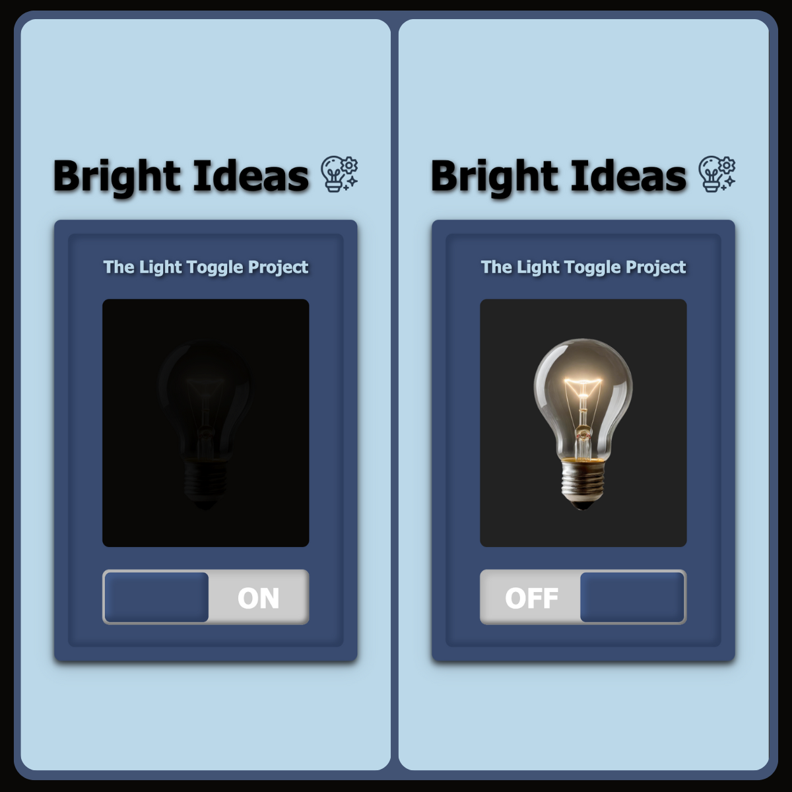

# Bright Ideas - Light Toggle Project 💡

**Bright Ideas** is a simple interactive web app that lets users toggle a light bulb on and off, built with HTML, CSS, and JavaScript. It's perfect for beginners learning basic web development concepts like DOM manipulation and event handling.

## Live Demo

Check out the live demo [here](https://davidadam1323.github.io/interactive-btn-project/).

## Preview



## Features

- Toggle a light bulb on/off with a switch.
- Smooth animations for a polished user experience.
- Responsive design.

## Technologies

- **HTML5**
- **CSS3**
- **JavaScript (ES6)**

## How to Use

1. Clone the repo:
   ```bash
   git clone https://github.com/your-username/bright-ideas.git
   cd bright-ideas
   ```
2. Open `index.html` in your browser or use a live server.

## Learning Objectives

- DOM manipulation with JavaScript.
- Event handling and UI updates.
- CSS animations and responsive design.

## License

This project is licensed under the MIT License.
